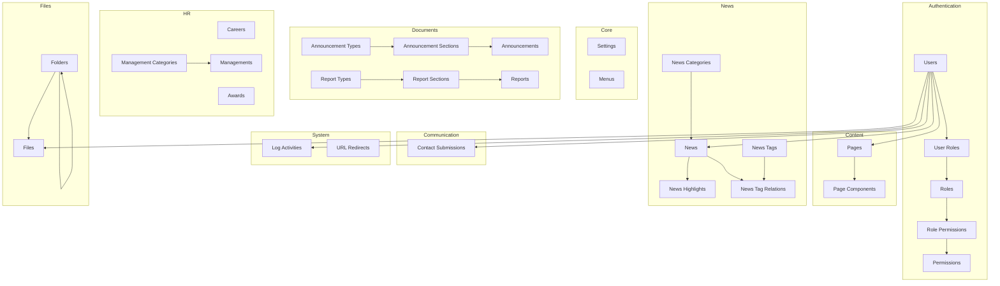

# 📊 Database Entity Relationship Diagram

## Overview

This document provides visual representation of the database schema relationships.

## Main Modules Relationship



## Detailed Entity Relationships

### 1. Authentication Module

```
┌─────────────────┐
│     USERS       │
│─────────────────│
│ PK: id          │
│ UK: email       │
│ UK: username    │
└─────────────────┘
        │
        │ 1:N
        ▼
┌─────────────────┐       ┌─────────────────┐
│   USER_ROLES    │  N:1  │     ROLES       │
│─────────────────│◄──────│─────────────────│
│ PK: id          │       │ PK: id          │
│ FK: user_id     │       │ UK: slug        │
│ FK: role_id     │       └─────────────────┘
└─────────────────┘               │
                                  │ 1:N
                                  ▼
                          ┌─────────────────────┐
                          │ ROLE_PERMISSIONS    │
                          │─────────────────────│
                          │ PK: id              │
                          │ FK: role_id         │
                          │ FK: permission_id   │
                          └─────────────────────┘
                                  │ N:1
                                  ▼
                          ┌─────────────────┐
                          │  PERMISSIONS    │
                          │─────────────────│
                          │ PK: id          │
                          │ UK: slug        │
                          └─────────────────┘
```

### 2. Core Module

```
┌─────────────────┐       ┌─────────────────┐
│    SETTINGS     │       │      MENUS      │
│─────────────────│       │─────────────────│
│ PK: id          │       │ PK: id          │
│ UK: key         │       │ FK: parent_id   │──┐
│    value (JSON) │       │    slug         │  │ Self-referencing
└─────────────────┘       └─────────────────┘  │ (Hierarchical)
                                  ▲─────────────┘
```

### 3. Content Module

```
┌─────────────────┐
│     USERS       │
│─────────────────│
│ PK: id          │
└─────────────────┘
        │
        │ 1:N (created_by)
        ▼
┌─────────────────┐
│      PAGES      │
│─────────────────│
│ PK: id          │
│ UK: slug        │
│ FK: created_by  │
│ FK: updated_by  │
└─────────────────┘
        │
        │ 1:N
        ▼
┌─────────────────────┐
│  PAGE_COMPONENTS    │
│─────────────────────│
│ PK: id              │
│ FK: page_id         │
│    type             │
│    data (JSON)      │
└─────────────────────┘
```

### 4. News Module

```
┌─────────────────────┐
│  NEWS_CATEGORIES    │
│─────────────────────│
│ PK: id              │
│ UK: slug            │
└─────────────────────┘
        │
        │ 1:N
        ▼
┌─────────────────┐       ┌─────────────────────┐
│      NEWS       │  1:N  │  NEWS_HIGHLIGHTS    │
│─────────────────│──────▶│─────────────────────│
│ PK: id          │       │ PK: id              │
│ UK: slug        │       │ FK: news_id         │
│ FK: category_id │       │    start_date       │
│ FK: created_by  │       │    end_date         │
└─────────────────┘       └─────────────────────┘
        │
        │ N:M (through NEWS_TAG_RELATIONS)
        ▼
┌──────────────────────┐       ┌─────────────────┐
│ NEWS_TAG_RELATIONS   │  N:1  │   NEWS_TAGS     │
│──────────────────────│──────▶│─────────────────│
│ PK: id               │       │ PK: id          │
│ FK: news_id          │       │ UK: slug        │
│ FK: tag_id           │       └─────────────────┘
└──────────────────────┘
```

### 5. Documents Module (3-Tier Structure)

#### Announcements:
```
┌───────────────────────┐
│  ANNOUNCEMENT_TYPES   │  Level 1
│───────────────────────│
│ PK: id                │
│ UK: slug              │
└───────────────────────┘
        │
        │ 1:N
        ▼
┌──────────────────────────┐
│  ANNOUNCEMENT_SECTIONS   │  Level 2
│──────────────────────────│
│ PK: id                   │
│ FK: type_id              │
│    slug                  │
└──────────────────────────┘
        │
        │ 1:N
        ▼
┌───────────────────┐
│  ANNOUNCEMENTS    │  Level 3
│───────────────────│
│ PK: id            │
│ FK: section_id    │
│    slug           │
│    file_url       │
└───────────────────┘
```

#### Reports:
```
┌─────────────────┐
│  REPORT_TYPES   │  Level 1
│─────────────────│
│ PK: id          │
│ UK: slug        │
└─────────────────┘
        │
        │ 1:N
        ▼
┌─────────────────────┐
│  REPORT_SECTIONS    │  Level 2
│─────────────────────│
│ PK: id              │
│ FK: type_id         │
│    slug             │
└─────────────────────┘
        │
        │ 1:N
        ▼
┌─────────────────┐
│     REPORTS     │  Level 3
│─────────────────│
│ PK: id          │
│ FK: section_id  │
│    slug         │
│    year         │
│    quarter      │
│    file_url     │
└─────────────────┘
```

### 6. HR Module

```
┌─────────────────────────┐
│ MANAGEMENT_CATEGORIES   │
│─────────────────────────│
│ PK: id                  │
│ UK: slug                │
└─────────────────────────┘
        │
        │ 1:N
        ▼
┌─────────────────┐       ┌─────────────────┐       ┌─────────────────┐
│  MANAGEMENTS    │       │     CAREERS     │       │     AWARDS      │
│─────────────────│       │─────────────────│       │─────────────────│
│ PK: id          │       │ PK: id          │       │ PK: id          │
│ UK: slug        │       │ UK: slug        │       │ UK: slug        │
│ FK: category_id │       │    department   │       │    issuer       │
└─────────────────┘       │    location     │       │    issue_date   │
                          └─────────────────┘       └─────────────────┘
```

### 7. Communication Module

```
┌─────────────────┐
│     USERS       │
│─────────────────│
│ PK: id          │
└─────────────────┘
        │
        │ 1:N (optional)
        ▼
┌─────────────────────────┐
│  CONTACT_SUBMISSIONS    │
│─────────────────────────│
│ PK: id                  │
│ FK: user_id (nullable)  │
│    name                 │
│    email                │
│    type                 │
│    status               │
│    ip_address           │
└─────────────────────────┘
```

### 8. System Module

```
┌─────────────────┐       ┌─────────────────────┐
│     USERS       │  1:N  │   LOG_ACTIVITIES    │
│─────────────────│──────▶│─────────────────────│
│ PK: id          │       │ PK: id              │
└─────────────────┘       │ FK: user_id         │
                          │    action           │
                          │    module           │
                          │    metadata (JSON)  │
                          └─────────────────────┘

┌─────────────────────┐
│   URL_REDIRECTS     │
│─────────────────────│
│ PK: id              │
│ UK: from_url        │
│    to_url           │
│    status_code      │
│    hits             │
└─────────────────────┘
```

### 9. Files Module

```
┌─────────────────┐
│     USERS       │
│─────────────────│
│ PK: id          │
└─────────────────┘
        │
        │ 1:N (created_by)
        ▼
┌─────────────────┐       ┌─────────────────┐
│    FOLDERS      │  1:N  │      FILES      │
│─────────────────│──────▶│─────────────────│
│ PK: id          │       │ PK: id          │
│ FK: parent_id   │──┐    │ FK: folder_id   │
│    path         │  │    │ FK: created_by  │
└─────────────────┘  │    │    cloud_key    │
        ▲────────────┘    │    mime_type    │
        Self-referencing  └─────────────────┘
        (Hierarchical)
```

## Relationship Cardinality Legend

- **1:1** - One-to-One
- **1:N** - One-to-Many
- **N:M** - Many-to-Many (through junction table)
- **FK** - Foreign Key
- **PK** - Primary Key
- **UK** - Unique Key

## Key Design Patterns

### 1. **RBAC (Role-Based Access Control)**
```
Users ──→ UserRoles ──→ Roles ──→ RolePermissions ──→ Permissions
```

### 2. **Hierarchical Data**
```
Menus    → parent_id (self-referencing)
Folders  → parent_id (self-referencing)
```

### 3. **3-Tier Documents**
```
Type → Section → Item
(Announcements & Reports)
```

### 4. **Audit Trail**
```
created_at, updated_at, deleted_at (soft delete)
created_by, updated_by (user tracking)
```

### 5. **Many-to-Many**
```
News ←→ NewsTagRelations ←→ Tags
Users ←→ UserRoles ←→ Roles
Roles ←→ RolePermissions ←→ Permissions
```

## Table Statistics

| Module | Tables | Relations |
|--------|--------|-----------|
| Authentication | 5 | 8 |
| Core | 2 | 1 |
| Content | 2 | 3 |
| News | 5 | 7 |
| Documents | 6 | 6 |
| HR | 4 | 1 |
| Communication | 1 | 1 |
| System | 2 | 1 |
| Files | 2 | 3 |
| **Total** | **29** | **31+** |

## Index Coverage

All tables include indexes on:
- Primary keys (automatic)
- Foreign keys
- Unique fields (email, username, slug)
- Status fields
- Date fields (created_at, published_at, etc.)
- Search fields (title, name)
- Composite indexes where applicable

---

**Total Tables**: 29  
**Total Relations**: 31+  
**Total Indexes**: 80+  
**Database**: PostgreSQL 14+  
**ORM**: Prisma 5.7.1
